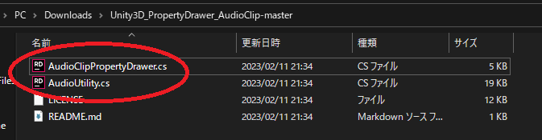

# Unity3D_PropertyDrawer_AudioClip

Draws a play button and waveform preview for serialized AudioClip fields

(It will also work with versions later than Unity2020.2.)

If you label your Audio Asset "ScratchAudio" the property will draw with a red overlay and text indicating it's ⁻ˢᶜʳᵃᵗᶜʰ⁻ state.

# How To Use

- Go to https://github.com/Ruchi12377/Unity3D_PropertyDrawer_AudioClip

- Click on **"Code"**, then **"Download ZIP"**

- Unzip the downloaded files and find in the folder
  Drag and drop **AudioClipPropertyDrawer.cs** and **AudioUtility.cs** into your Unity project.

- Now it's ready to use.

If you encounter any problems, please contact [HERE](https://twitter.com/Ruchi12377).

# Reference

[【Unity】エディタ上でスクリプトからAudioClipを再生する(Unity 2020.2からPlayClip -&gt; PlayPreviewClipになったので注意) - はなちるのマイノート](https://www.hanachiru-blog.com/entry/2022/09/22/120000)

[UnityCsReference/AudioUtil.bindings.cs at master · Unity-Technologies/UnityCsReference · GitHub](https://github.com/Unity-Technologies/UnityCsReference/blob/master/Editor/Mono/Audio/Bindings/AudioUtil.bindings.cs)
